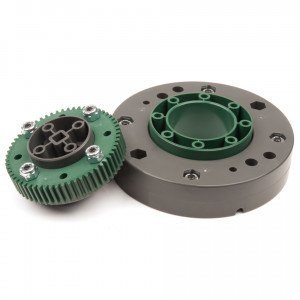

## Vélbúnaður
Hér skal gera töflu eða lista yfir allan búnað sem notaður er gott væri að þið nýttuð ykkur töfluna hér fyrir neðan:

  | Vél | rafbúnaður | Spenna | Viðnám |
  | --- | --- | --- | --- | --- |
  | Arduino uno |   |   |   | 
  | MQ7 | 5V | 33ohm |   |
  | Breadboard |   |   |   | 
  | Vex 239 motor |   | 7,2V |   |
