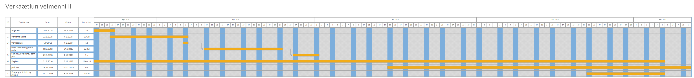

## Verkáæltun
Hér skal gera verkáætlun og tímaáætlun, setja in mynd af henni gerð í https://draw.io veljið Flowcharts-gant .  þegar þið hafið lokið við grafið farið í export-image og vistið sem `gant` í skyrsla/img

